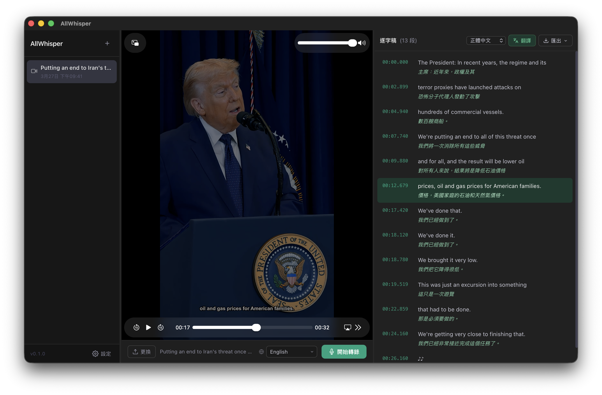

<div align="center">


# AllWhisper

**本地的影片轉錄桌面應用 · Whisper 驅動**

[](LICENSE)
[](#下載)
[](https://tauri.app)
[](https://www.rust-lang.org)
[](https://svelte.dev)

[繁體中文](README.md) · [English](/readme/README.en.md) · [简体中文](/readme/README.zh-CN.md) · [日本語](/readme/README.ja.md)



</div>

---

拖入影片，秒出逐字稿。完全本地執行，資料不離機。

- 🔒 **離線優先** — 本地 Whisper 模型，無需網路、無需 API Key
- ⏱️ **時間同步** — 點擊任一段落即跳至影片對應時間點
- ✏️ **即時編輯** — 雙擊修正錯字，自動儲存
- 🌐 **多服務翻譯** — Google、OpenAI、Gemini、Claude、Bing、LibreTranslate…
- 📤 **彈性匯出** — TXT / SRT / VTT / JSON，支援原文、譯文、雙語並排
- 🔡 **多語系 UI** — 繁中 · 简中 · English · 日本語 · 한국어 · Tiếng Việt

---

## ⚠️ 前置需求：安裝 ffmpeg

**無論是直接下載安裝版或從原始碼建置，均需先安裝 ffmpeg。**
AllWhisper 使用 ffmpeg 萃取影片音訊，缺少時無法轉錄。

```bash
brew install ffmpeg        # macOS（Homebrew）
choco install ffmpeg       # Windows（Chocolatey）
```

> 安裝後確認 `ffmpeg` 已加入系統 PATH，或可由 Homebrew / Chocolatey 自動設定。

---

## 下載

前往 [Releases](../../releases) 下載預先建置版本：

| 平台 | 格式 |
|------|------|
| macOS（Apple Silicon / Intel） | `.dmg` |
| Windows | `.msi` / `.exe` |

---

## 本地 Whisper 模型

開啟 **設定 → 轉錄引擎**，從內建清單一鍵下載模型，無需手動管理檔案。

| 模型 | 大小 | 速度 | 準確度 | 建議用途 |
|------|------|------|--------|--------|
| `tiny` | ~75 MB | ⚡⚡⚡⚡⚡ | ★★☆☆☆ | 快速測試 |
| `base` | ~142 MB | ⚡⚡⚡⚡ | ★★★☆☆ | 輕量入門 |
| `small` | ~466 MB | ⚡⚡⚡ | ★★★★☆ | **推薦一般使用** |
| `medium` | ~1.5 GB | ⚡⚡ | ★★★★☆ | 高準確度 |
| `large-v3` | ~3.1 GB | ⚡ | ★★★★★ | 最高品質 |
| `large-v3-turbo` | ~1.6 GB | ⚡⚡ | ★★★★★ | **推薦首選** — large 品質、turbo 速度 |

---

## 翻譯服務

轉錄完成後可一鍵翻譯逐字稿，結果顯示在原文下方，並可雙語匯出。

| 服務 | 需要 API Key | 說明 |
|------|------------|------|
| **免費 Google 翻譯** | ❌ | 無需任何設定，每段自動延遲避免限流 |
| Google Cloud Translate | ✅ | Cloud Translation API v2 |
| Bing Translator | ✅ | Azure Cognitive Services |
| LibreTranslate | 選填 | 可自架開源翻譯服務 |
| OpenAI | ✅ | gpt-4o-mini 等模型 |
| Gemini | ✅ | Google AI Studio |
| Grok | ✅ | xAI API |
| Claude | ✅ | Anthropic |
| OpenRouter | ✅ | 統一入口存取數百個模型 |

在 **設定 → 翻譯服務** 中選擇服務並填入對應 API Key 即可啟用。

---

## 從原始碼建置

```bash
git clone https://github.com/yourname/AllWhisper.git
cd AllWhisper && npm install
npm run tauri dev                                    # 開發
npm run tauri build                                  # 正式（雲端 API）
npm run tauri build -- --features local-whisper      # 含本地 Whisper
```

> **需要：** Rust 1.70+、Node.js 18+、ffmpeg；本地 Whisper 模式額外需要 C++ 工具鏈（macOS: `xcode-select --install` / Windows: Visual Studio Build Tools）

---

## 技術棧

- **前端** — [Svelte 5](https://svelte.dev) + TypeScript + Vite
- **後端** — [Rust](https://www.rust-lang.org) + [Tauri 2](https://tauri.app)
- **本地轉錄** — [whisper-rs](https://github.com/tazz4843/whisper-rs)（whisper.cpp Rust bindings）
- **雲端轉錄** — `reqwest` → OpenAI `/v1/audio/transcriptions`
- **翻譯** — `reqwest` + [rust-translators](https://github.com/charl1e7/rust-translators)
- **中文轉換** — [opencc-js](https://github.com/nk2028/opencc-js)（簡繁互轉）
- **資料持久化** — [tauri-plugin-store](https://github.com/tauri-apps/plugins-workspace)

---

## 參與貢獻

歡迎 PR！大功能請先開 Issue 討論。

```bash
git checkout -b feat/my-feature
git commit -m 'feat: ...'
# 開 Pull Request
```

---

## 藍圖

- [ ] 說話者辨識
- [ ] 批次轉錄
- [ ] 即時語音轉錄
- [ ] 雲端 API 修復
- [ ] 自動更新

---

[MIT](LICENSE) © AllWhisper Contributors
