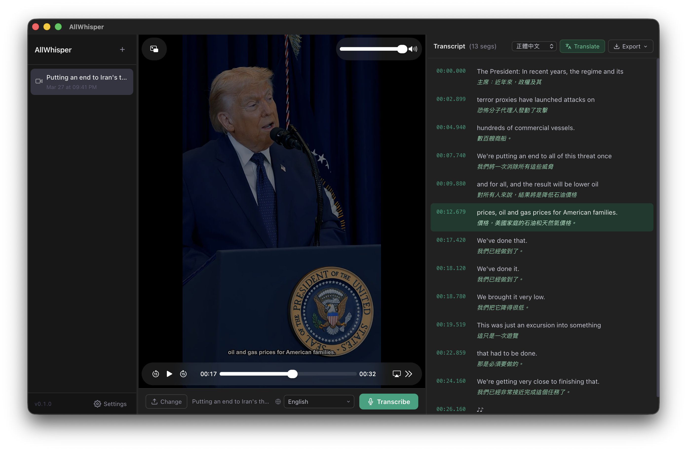

<div align="center">


# AllWhisper

**Local-first video transcription desktop app · Powered by Whisper**

[](../LICENSE)
[](#download)
[](https://tauri.app)
[](https://www.rust-lang.org)
[](https://svelte.dev)

[繁體中文](/README.md) · [English](README.en.md) · [简体中文](README.zh-CN.md) · [日本語](README.ja.md)



</div>

---

Drop in a video, get a transcript in seconds. Runs entirely on your machine — your data never leaves.

- 🔒 **Offline-first** — Local Whisper models, no internet or API key required
- ⏱️ **Time-synced** — Click any segment to jump to that moment in the video
- ✏️ **Inline editing** — Double-click to correct errors, auto-saved
- 🌐 **Multi-service translation** — Google, OpenAI, Gemini, Claude, Bing, LibreTranslate…
- 📤 **Flexible export** — TXT / SRT / VTT / JSON, with original, translated, or bilingual formats
- 🔡 **Multilingual UI** — English · 繁中 · 简中 · 日本語 · 한국어 · Tiếng Việt

---

## ⚠️ Prerequisite: Install ffmpeg

**ffmpeg is required whether you download the prebuilt app or build from source.**
AllWhisper uses ffmpeg to extract audio from video files — transcription will fail without it.

```bash
brew install ffmpeg        # macOS (Homebrew)
choco install ffmpeg       # Windows (Chocolatey)
```

> After installation, make sure `ffmpeg` is on your system PATH. Homebrew and Chocolatey handle this automatically.

---

## Download

Download prebuilt binaries from the [Releases](../../releases) page:

| Platform | Format |
|----------|--------|
| macOS (Apple Silicon / Intel) | `.dmg` |
| Windows | `.msi` / `.exe` |

---

## Local Whisper Models

Open **Settings → Transcription Engine** to download models directly inside the app — no manual file management needed.

| Model | Size | Speed | Accuracy | Best for |
|-------|------|-------|----------|----------|
| `tiny` | ~75 MB | ⚡⚡⚡⚡⚡ | ★★☆☆☆ | Quick testing |
| `base` | ~142 MB | ⚡⚡⚡⚡ | ★★★☆☆ | Lightweight use |
| `small` | ~466 MB | ⚡⚡⚡ | ★★★★☆ | **Recommended for general use** |
| `medium` | ~1.5 GB | ⚡⚡ | ★★★★☆ | High accuracy |
| `large-v3` | ~3.1 GB | ⚡ | ★★★★★ | Best quality |
| `large-v3-turbo` | ~1.6 GB | ⚡⚡ | ★★★★★ | **Top pick** — large quality at turbo speed |

---

## Translation Services

After transcription, translate the full transcript with one click. Results appear inline below each segment and can be exported in bilingual format.

| Service | API Key | Notes |
|---------|---------|-------|
| **Free Google Translate** | ❌ | No setup required; auto-delays between segments to avoid rate limits |
| Google Cloud Translate | ✅ | Cloud Translation API v2 |
| Bing Translator | ✅ | Azure Cognitive Services |
| LibreTranslate | Optional | Open-source, self-hostable |
| OpenAI | ✅ | gpt-4o-mini and other models |
| Gemini | ✅ | Google AI Studio |
| Grok | ✅ | xAI API |
| Claude | ✅ | Anthropic |
| OpenRouter | ✅ | Unified access to hundreds of models |

Configure in **Settings → Translation Service** by selecting a provider and entering your API key.

---

## Build from Source

```bash
git clone https://github.com/yourname/AllWhisper.git
cd AllWhisper && npm install
npm run tauri dev                                    # development
npm run tauri build                                  # production (cloud API)
npm run tauri build -- --features local-whisper      # with local Whisper
```

> **Requirements:** Rust 1.70+, Node.js 18+, ffmpeg; local Whisper mode additionally requires a C++ toolchain (macOS: `xcode-select --install` / Windows: Visual Studio Build Tools)

---

## Tech Stack

- **Frontend** — [Svelte 5](https://svelte.dev) + TypeScript + Vite
- **Backend** — [Rust](https://www.rust-lang.org) + [Tauri 2](https://tauri.app)
- **Local transcription** — [whisper-rs](https://github.com/tazz4843/whisper-rs) (whisper.cpp Rust bindings)
- **Cloud transcription** — `reqwest` → OpenAI `/v1/audio/transcriptions`
- **Translation** — `reqwest` + [rust-translators](https://github.com/charl1e7/rust-translators)
- **Chinese conversion** — [opencc-js](https://github.com/nk2028/opencc-js) (Simplified ↔ Traditional)
- **Persistence** — [tauri-plugin-store](https://github.com/tauri-apps/plugins-workspace)

---

## Contributing

PRs are welcome! For major changes, please open an Issue first to discuss the approach.

```bash
git checkout -b feat/my-feature
git commit -m 'feat: ...'
# Open a Pull Request
```

---

## Roadmap

- [ ] Speaker diarization
- [ ] Batch transcription
- [ ] Real-time transcription
- [ ] Cloud API fix & re-enable
- [ ] Auto-update

---

[MIT](../LICENSE) © AllWhisper Contributors
