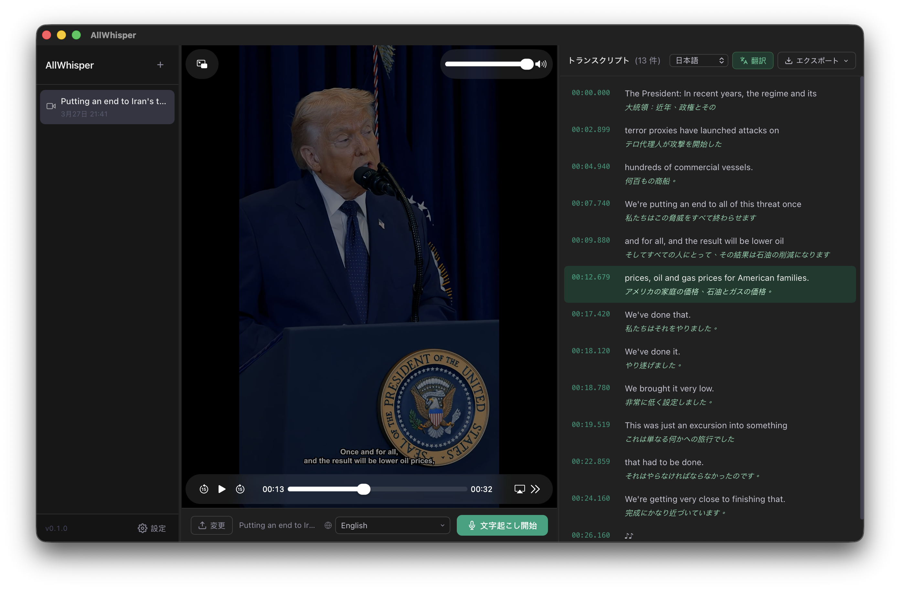

<div align="center">


# AllWhisper

**ローカルファーストの動画・音声文字起こしデスクトップアプリ — Whisper AI 搭載**

[English](/readme/README.en.md) · [繁體中文](../README.md) · [简体中文](/readme/README.zh-CN.md)

[](LICENSE)
[](#ダウンロード)
[](https://tauri.app)
[](https://www.rust-lang.org/)
[](https://svelte.dev/)

[ダウンロード](#ダウンロード) · [機能](#機能) · [使い方](#使い方) · [コントリビュート](#コントリビュート)

<p align="center">
  
</p>


</div>

---

## AllWhisper とは？

AllWhisper は**プライバシーを重視したオープンソースのデスクトップアプリ**です。動画・音声ファイルをタイムスタンプ付きのテキストに文字起こし——すべてあなたのデバイス上で完結します。クラウド API を使用しない限り、データが外部に送信されることはありません。

- 動画をドロップ → 数秒で同期・編集可能なトランスクリプトを取得
- 任意の行をクリックして、動画の該当シーンにジャンプ
- トランスクリプトを数十の言語に翻訳
- SRT・VTT・TXT・JSON 形式でエクスポート

> コンテンツクリエイター、ジャーナリスト、研究者など、メディアをサードパーティのサーバーに送ることなく、高精度な文字起こしを必要とするすべての方に。

---

## 機能

| 機能 | 説明 |
|------|------|
| 🎥 **ドラッグ＆ドロップ** | MP4、MOV、MKV、AVI、WebM、MP3、WAV など、あらゆる動画・音声ファイルに対応 |
| 🔒 **ローカル Whisper** | [whisper.cpp](https://github.com/ggerganov/whisper.cpp) によるオンデバイス文字起こし——インターネット不要 |
| ☁️ **クラウド API** | OpenAI 互換の `/v1/audio/transcriptions` エンドポイントに対応（OpenAI、Groq など） |
| ⏱️ **タイムスタンプ** | トランスクリプトのセグメントをクリックして、動画の対応シーンにジャンプ |
| ✏️ **インライン編集** | セグメントをダブルクリックして誤字を修正——自動保存 |
| 🌐 **翻訳機能** | Google、Bing、LibreTranslate、OpenAI、Gemini、Claude など複数の翻訳サービスに対応 |
| 📤 **エクスポート** | TXT・SRT・VTT・JSON 形式でエクスポート——原文・訳文・バイリンガル形式を選択可能 |
| 💾 **セッション履歴** | すべてのセッションを自動保存、いつでも過去のトランスクリプトを再確認 |
| 🔡 **多言語 UI** | English、繁體中文、简体中文、한국어、Tiếng Việt に対応 |
| 🔀 **リサイズ可能なパネル** | 区切り線をドラッグして、サイドバー・動画・トランスクリプトのレイアウトを自由に調整 |
| 📦 **モデルマネージャー** | アプリ内から Whisper GGML モデルを直接ダウンロード・管理 |

---

## スクリーンショット

> *（スクリーンショットは近日公開予定）*

---

## ダウンロード

ビルド済みのバイナリは [Releases](../../releases) ページからダウンロードできます：

| プラットフォーム | 形式 |
|----------------|------|
| macOS（Apple Silicon & Intel） | `.dmg` |
| Windows | `.msi` / `.exe` |

---

## 使い方

### 前提条件

- **ffmpeg** がシステムの PATH に含まれている必要があります

  ```bash
  # macOS
  brew install ffmpeg

  # Windows（Chocolatey 経由）
  choco install ffmpeg
  ```

### 文字起こしモード

#### ローカル Whisper（推奨——完全オフライン）

1. **設定 → 文字起こしエンジン** を開く
2. 内蔵のモデル一覧から希望のモデルを選び、**ダウンロード** をクリック
3. ダウンロード完了後、**使用** をクリックして有効化
4. 言語を選択して **文字起こし開始** をクリック

推奨モデル：

| モデル | サイズ | 速度 | 精度 |
|--------|--------|------|------|
| `tiny` | ~75 MB | ⚡⚡⚡⚡ | ★★☆☆ |
| `base` | ~142 MB | ⚡⚡⚡ | ★★★☆ |
| `small` | ~466 MB | ⚡⚡ | ★★★★ ← おすすめ |
| `large-v3-turbo` | ~1.6 GB | ⚡ | ★★★★★ ← 最高精度 |

#### クラウド API

OpenAI 互換の文字起こしサービスであれば何でも利用可能：

- [OpenAI](https://platform.openai.com) — モデル：`whisper-1` または `gpt-4o-transcribe`
- [Groq](https://console.groq.com) — モデル：`whisper-large-v3`（超高速）

**設定 → 文字起こしエンジン** で Base URL と API Key を入力してください。

---

## ソースからビルド

### 必要環境

- [Rust](https://rustup.rs/) 1.70+
- [Node.js](https://nodejs.org/) 18+
- [ffmpeg](https://ffmpeg.org/)（実行時の依存関係）
- C++ ツールチェーン——ローカル Whisper モードのみ必要
  - macOS：Xcode Command Line Tools（`xcode-select --install`）
  - Windows：Visual Studio Build Tools

### 開発モード

```bash
git clone https://github.com/yourname/AllWhisper.git
cd AllWhisper
npm install
npm run tauri dev
```

### 本番ビルド

```bash
# クラウド API のみ（高速——C++ ツールチェーン不要）
npm run tauri build

# ローカル Whisper サポート付き（whisper.cpp のコンパイルに 5〜10 分かかります）
npm run tauri build -- --features local-whisper
```

> ⚠️ macOS ビルドには `MACOSX_DEPLOYMENT_TARGET=10.15` が必要です（`.cargo/config.toml` に設定済み）。

**出力先：**

- macOS：`src-tauri/target/release/bundle/dmg/AllWhisper_*.dmg`
- Windows：`src-tauri/target/release/bundle/msi/AllWhisper_*.msi`

---

## 技術スタック

| レイヤー | 技術 |
|----------|------|
| フロントエンド | [Svelte 5](https://svelte.dev) + TypeScript + Vite |
| バックエンド | [Rust](https://www.rust-lang.org) + [Tauri 2](https://tauri.app) |
| ローカル文字起こし | [whisper-rs](https://github.com/tazz4843/whisper-rs)（whisper.cpp Rust バインディング） |
| クラウド文字起こし | `reqwest` → OpenAI `/v1/audio/transcriptions` |
| 翻訳 | `reqwest` + [rust-translators](https://github.com/charl1e7/rust-translators) |
| 中国語変換 | [opencc-js](https://github.com/nk2028/opencc-js) |
| データ永続化 | [tauri-plugin-store](https://github.com/tauri-apps/plugins-workspace) |

---

## コントリビュート

あらゆる形のコントリビュートを歓迎します！以下の手順でお願いします：

1. リポジトリを Fork する
2. フィーチャーブランチを作成（`git checkout -b feat/amazing-feature`）
3. 変更をコミット（`git commit -m 'feat: add amazing feature'`）
4. ブランチをプッシュ（`git push origin feat/amazing-feature`）
5. Pull Request を作成

大きな変更は、まず Issue を立てて方針を議論してください。

---

## ロードマップ

- [ ] 話者識別（複数の話者を区別）
- [ ] クラウド API 文字起こしのバグ修正と再有効化
- [ ] バッチ文字起こし（複数ファイルの同時処理）
- [ ] カスタム語彙 / ホットワード
- [ ] 自動アップデート

---

## ライセンス

[MIT](LICENSE) © AllWhisper Contributors
