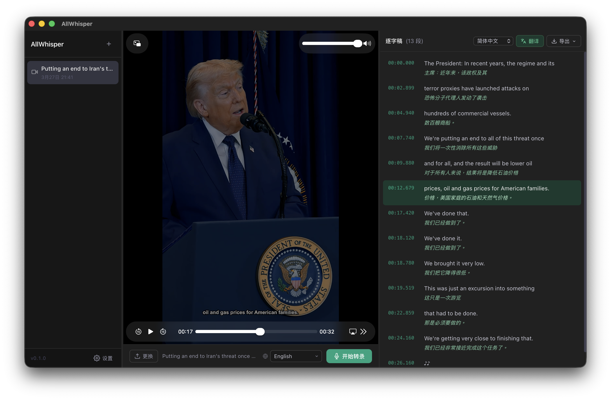

<div align="center">


# AllWhisper

**本地优先的视频与音频转录桌面应用程序 — 由 Whisper 驱动**

[English](/readme/README.en.md) · [繁體中文](../README.md) · [日本語](/readme/README.ja.md)

[](LICENSE)
[](#下载)
[](https://tauri.app)
[](https://www.rust-lang.org/)
[](https://svelte.dev/)

[下载](#下载) · [功能特色](#功能特色) · [快速开始](#快速开始) · [参与贡献](#参与贡献)

<p align="center">
  
</p>

</div>

---

## AllWhisper 是什么？

AllWhisper 是一款**注重隐私的开源桌面应用程序**，能将视频与音频文件转录成带有时间戳的文字——完全在您的设备上运行。除非您主动选择使用云端 API，否则您的数据绝不会离开本机。

- 拖入视频 → 数秒内获得可同步编辑的逐字稿
- 点击任意一行，即可跳至视频对应时间点播放
- 将逐字稿翻译成数十种语言
- 导出为 SRT、VTT、TXT 或 JSON

> 专为内容创作者、记者、研究人员及所有需要精准转录、同时不希望将媒体上传至第三方服务器的用户设计。

---

## 功能特色

| 功能 | 说明 |
|------|------|
| 🎥 **拖放操作** | 支持拖放任何视频或音频文件——MP4、MOV、MKV、AVI、WebM、MP3、WAV 等 |
| 🔒 **本地 Whisper** | 通过 [whisper.cpp](https://github.com/ggerganov/whisper.cpp) 在设备上进行转录，完全离线 |
| ☁️ **云端 API** | 兼容任何 OpenAI 格式的 `/v1/audio/transcriptions` 端点（OpenAI、Groq 等） |
| ⏱️ **时间戳** | 点击任意逐字稿段落，即可跳至视频对应时间点 |
| ✏️ **即时编辑** | 双击任意段落可修正转录错误，自动保存 |
| 🌐 **翻译功能** | 支持 Google、Bing、LibreTranslate、OpenAI、Gemini、Claude 等多种翻译服务 |
| 📤 **多格式导出** | 导出 TXT、SRT、VTT 或 JSON——支持原文、译文或双语并排格式 |
| 💾 **会话记录** | 所有会话自动持久化，随时重新打开任意转录记录 |
| 🔡 **多语言界面** | 界面支持 English、繁體中文、简体中文、日本語、한국어、Tiếng Việt |
| 📦 **模型管理器** | 直接在应用程序内下载与管理 Whisper GGML 模型 |

---

## 截图

> *（截图即将推出）*

---

## 下载

预先构建的安装包可在 [Releases](../../releases) 页面获取：

| 平台 | 格式 |
|------|------|
| macOS（Apple Silicon 与 Intel） | `.dmg` |
| Windows | `.msi` / `.exe` |

---

## 快速开始

### 前置需求

- 系统需安装 **ffmpeg** 并加入 PATH

  ```bash
  # macOS
  brew install ffmpeg

  # Windows（通过 Chocolatey）
  choco install ffmpeg
  ```

### 转录模式

#### 本地 Whisper（推荐——完全离线）

1. 打开 **设置 → 转录引擎**
2. 在内置模型列表中选择模型，点击 **下载**
3. 下载完成后点击 **使用** 即可启用
4. 选择语言后点击 **开始转录**

模型推荐：

| 模型 | 大小 | 速度 | 准确度 |
|------|------|------|--------|
| `tiny` | ~75 MB | ⚡⚡⚡⚡ | ★★☆☆ |
| `base` | ~142 MB | ⚡⚡⚡ | ★★★☆ |
| `small` | ~466 MB | ⚡⚡ | ★★★★ ← 推荐 |
| `large-v3-turbo` | ~1.6 GB | ⚡ | ★★★★★ ← 最高质量 |

#### 云端 API

支持任何 OpenAI 兼容的转录服务：

- [OpenAI](https://platform.openai.com) — 模型：`whisper-1` 或 `gpt-4o-transcribe`
- [Groq](https://console.groq.com) — 模型：`whisper-large-v3`（速度极快）

请在 **设置 → 转录引擎** 中填入 Base URL 与 API Key。

---

## 从源码构建

### 环境需求

- [Rust](https://rustup.rs/) 1.70+
- [Node.js](https://nodejs.org/) 18+
- [ffmpeg](https://ffmpeg.org/)（运行时依赖）
- C++ 工具链——仅本地 Whisper 模式需要
  - macOS：Xcode Command Line Tools（`xcode-select --install`）
  - Windows：Visual Studio Build Tools

### 开发模式

```bash
git clone https://github.com/yourname/AllWhisper.git
cd AllWhisper
npm install
npm run tauri dev
```

### 正式打包

```bash
# 仅云端 API（快速，无需 C++ 工具链）
npm run tauri build

# 含本地 Whisper 支持（需编译 whisper.cpp，约需 5–10 分钟）
npm run tauri build -- --features local-whisper
```

> ⚠️ macOS 构建需要 `MACOSX_DEPLOYMENT_TARGET=10.15`（已配置于 `.cargo/config.toml`）。

**输出位置：**

- macOS：`src-tauri/target/release/bundle/dmg/AllWhisper_*.dmg`
- Windows：`src-tauri/target/release/bundle/msi/AllWhisper_*.msi`

---

## 技术栈

| 层级 | 技术 |
|------|------|
| 前端 | [Svelte 5](https://svelte.dev) + TypeScript + Vite |
| 后端 | [Rust](https://www.rust-lang.org) + [Tauri 2](https://tauri.app) |
| 本地转录 | [whisper-rs](https://github.com/tazz4843/whisper-rs)（whisper.cpp Rust bindings） |
| 云端转录 | `reqwest` → OpenAI `/v1/audio/transcriptions` |
| 翻译功能 | `reqwest` + [rust-translators](https://github.com/charl1e7/rust-translators) |
| 中文转换 | [opencc-js](https://github.com/nk2028/opencc-js) |
| 数据持久化 | [tauri-plugin-store](https://github.com/tauri-apps/plugins-workspace) |

---

## 参与贡献

欢迎任何形式的贡献！请按照以下步骤：

1. Fork 此仓库
2. 创建功能分支（`git checkout -b feat/amazing-feature`）
3. 提交您的更改（`git commit -m 'feat: add amazing feature'`）
4. 推送分支（`git push origin feat/amazing-feature`）
5. 提交 Pull Request

重大变更请先开 Issue 讨论方向。

---

## 开发路线图

- [ ] 说话人识别（区分多位发言者）
- [ ] 云端 API 转录修复与重新启用
- [ ] 批量转录（同时处理多个文件）
- [ ] 即时语音转录与翻译
- [ ] 自动更新

---

## 许可证

[MIT](LICENSE) © AllWhisper Contributors
